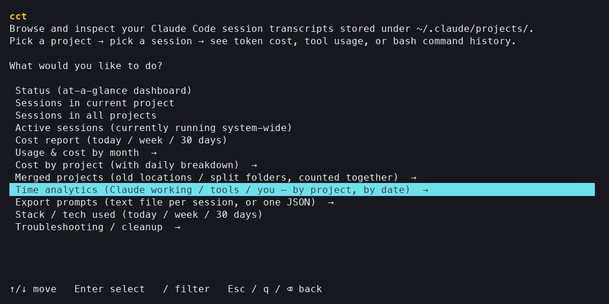
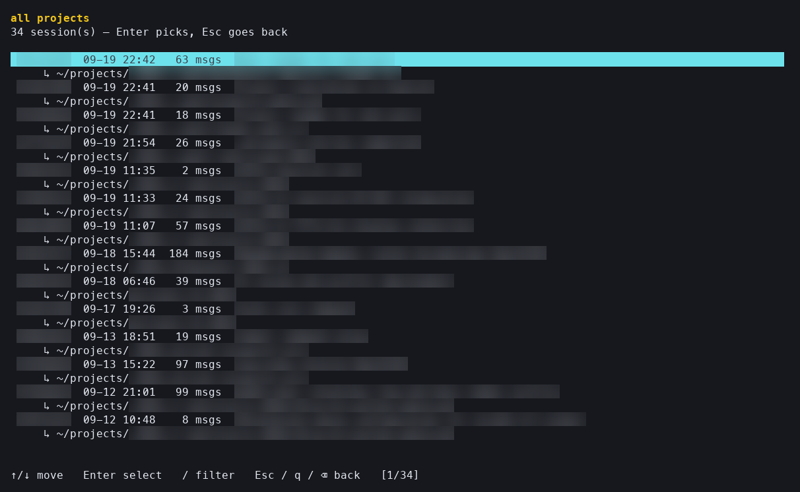
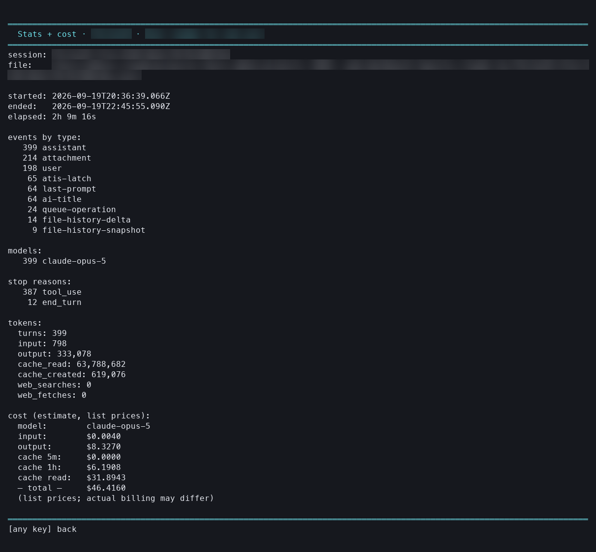
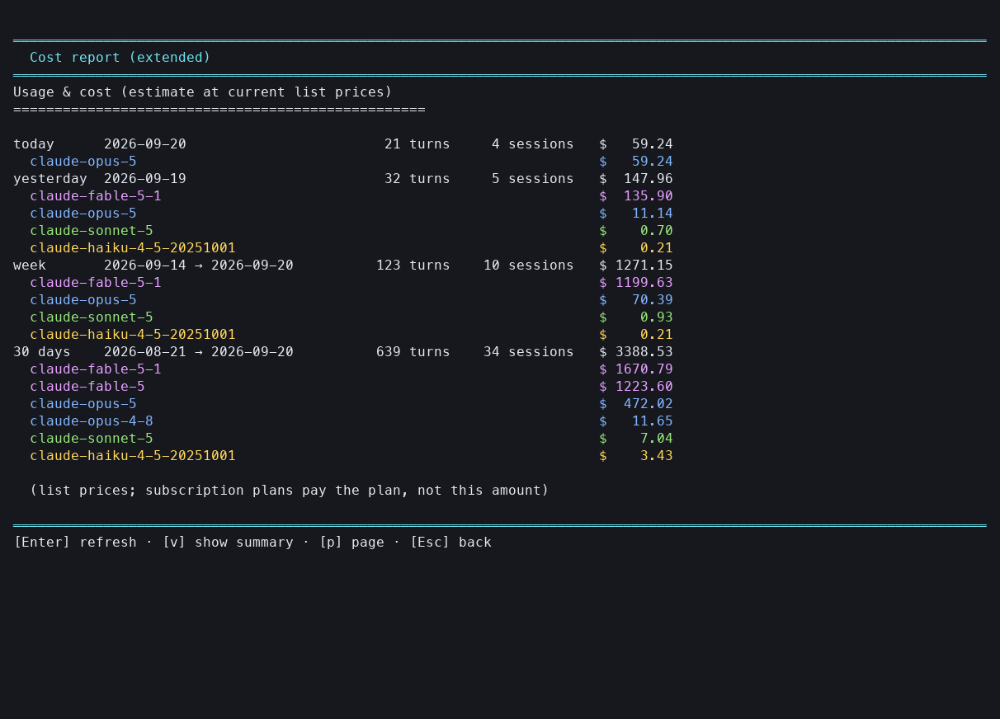
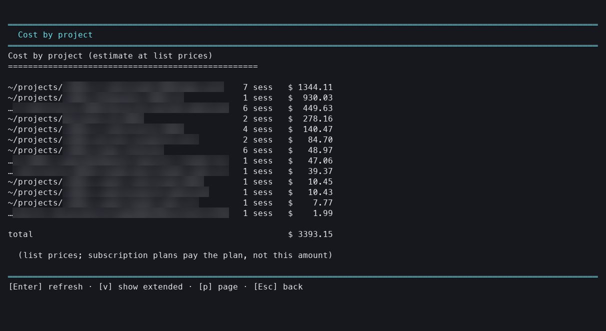
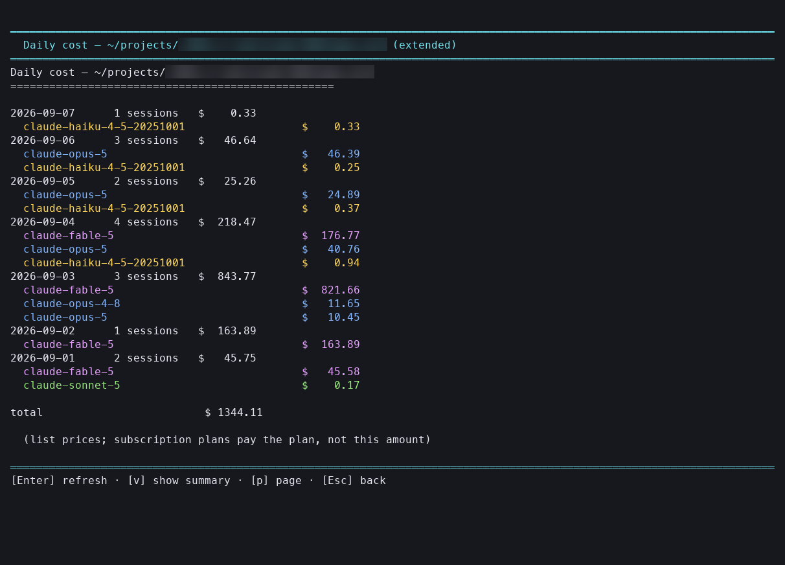
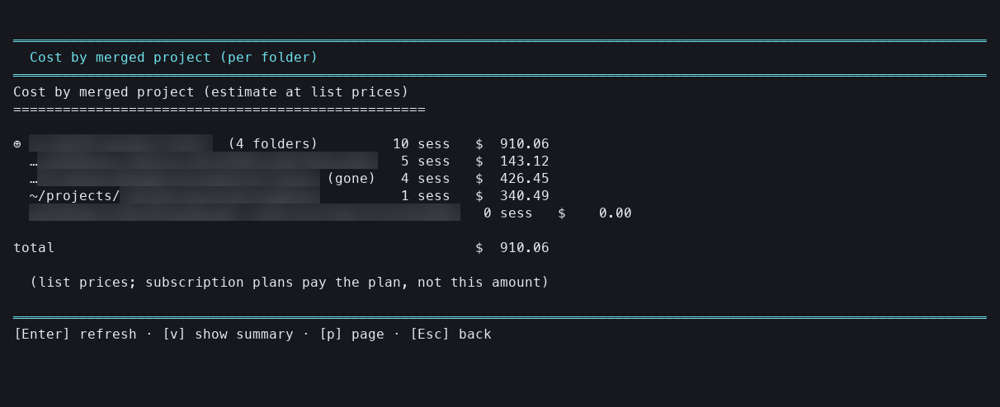
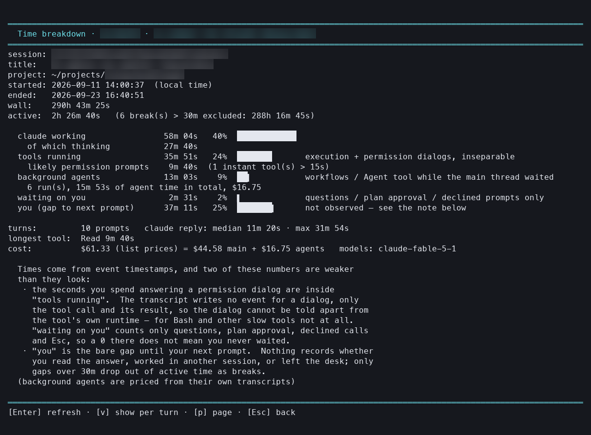
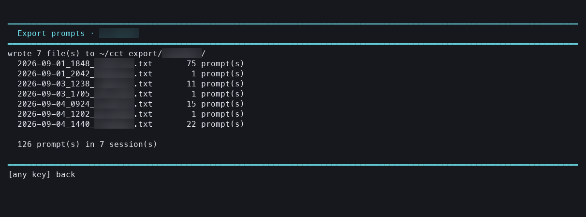

# cct — Claude Code session browser

See what Claude Code has been doing on your machine: which sessions ran, what
they cost, which tools and files they touched, and what you actually typed.

Claude Code stores every session as a transcript under `~/.claude/projects/`,
but gives you no way to list or inspect them outside its own resume picker.
`cct` is an arrow-key terminal UI over those transcripts — no UUIDs, no paths to
type. It reads only; it never modifies or deletes your Claude Code state.


*What's running right now, what it has cost you today and this month, what is
left to clean up.*


*And where the hours went — per project, split into Claude generating, tools
running, background agents, waiting on you, and the gap until your next
prompt. Every table spells out what those last two can and cannot know. Project
names, paths, session ids and titles, and prompt text are blurred in all
screenshots.*

This page is the tour. **[docs/reference.md](docs/reference.md)** is the manual:
every script with its options and example output, how long Claude Code keeps the
transcripts everything here is built on
([`cleanupPeriodDays`](docs/reference.md#how-long-transcripts-live-cleanupperioddays)),
[how the cost estimate is computed](docs/reference.md#cost-model),
[what the time buckets mean](docs/reference.md#time-reportpy), and the shape of
the transcript format itself.

> **Heads-up.** cct is a homegrown tool, written for personal use and shared
> as is. It may contain bugs — including in the numbers. Costs in particular
> are this tool's own estimate: token counts read from transcripts, priced at
> public list prices, with its own idea of what counts as one API call. They
> can be wrong, and they are never a bill. Check your provider's billing page
> for what you actually pay.

## Requirements

- macOS or Linux, `bash`
- [`jq`](https://jqlang.github.io/jq/) — `brew install jq` / `apt install jq`
- `python3` (3.8+) — stdlib only, nothing to `pip install`

## Install

```bash
git clone <this-repo> claude-code-cct
cd claude-code-cct
./install.sh          # symlinks cct into ~/.local/bin
```

Make sure `~/.local/bin` is on your `PATH` (the installer tells you if it isn't).
Because it's a symlink, `git pull` updates the installed command too.

```bash
./install.sh --force     # replace an unrelated cct already in ~/.local/bin
./uninstall.sh           # remove the symlink (its state and config files are
                         # listed for you to delete by hand — nothing else is removed)
```

## Use it

```bash
cct       # from any directory
```

You get a menu:



| Entry | What you see |
| --- | --- |
| **Status** | At-a-glance dashboard: live sessions, today/week/30-day cost, cleanup hints |
| **Sessions in current project** | Sessions for the directory you're standing in |
| **Sessions in all projects** | Every session Claude Code knows about |
| **Active sessions** | Claude Code processes running right now, system-wide |
| **Cost report** | Estimated token spend: today / yesterday / week / 30 days |
| **Usage & cost by month** | Per-month totals, ←/→ to step between months |
| **Cost by project** | Spend ranked by project, with a daily trend per project |
| **Merged projects** | Bind an old location or a split-off folder to a primary project and see cost, sessions, time and exports for them together |
| **Time analytics** | Where the hours went: Claude working, tools running, waiting on you, the gap to your next prompt — per project, per day, per session |
| **Export prompts** | Your typed prompts as one text file per session, or one JSON with per-prompt stats |
| **Stack / tech used** | Languages and ecosystems you worked on, by time window |
| **Troubleshooting / cleanup** | Dead project folders, stale session markers |

**Status** is the dashboard at the top of this page — what's running, what today
and this month cost, what needs cleaning up.

The session picker lists every session with its date, message count, title and
project:



Pick a session and you can see its **stats + cost**, its **time breakdown**
(how long Claude worked, how long tools ran, how long it waited on you), its
**tool usage** (files read/written/edited, bash commands), or **your prompts**
— just what you typed, without tool noise — and export those prompts to a file.



### Where the money goes

**Cost report** sums recent spend; press `v` for the extended view, which splits
every window by model (Fable magenta, Opus blue, Sonnet green, Haiku yellow):



**Cost by project** ranks your projects by total spend:



Pick the most expensive one and you get its day-by-day trend — `v` again breaks
each day down by model, which is usually where an expensive week explains
itself:



### One project, several folders

Claude Code files transcripts by the folder you opened. Move or rename a
project and its history splits in two; open a repo from two subfolders and you
get two "projects". **Merged projects** fixes the bookkeeping without touching
anything on disk: pick the primary folder (the project as it is today), add the
old locations — folders that no longer exist show as *(gone)* — or the split-off
subfolders, and the merged project gets its own cost, session list, time
analytics and export, all counted together. The plain per-folder views stay as
they were; bindings live in `~/.config/cct/merges.json`.



### Where the time goes

**Time analytics** turns the event timestamps of every session into five
buckets: **Claude working** (generating, including thinking), **tools running**
(tool calls incl. permission dialogs), **agents** (background agents and
workflows running while the main thread waited), **waiting on you** (questions,
plan approval, declined prompts) and **you** (the gap until your next prompt).
Gaps longer than 30 minutes count as breaks and are left out of active time.
You get it per project, per day, per session, and per turn inside one session
(how long each reply took, how many tool calls, what it cost). Days are local
calendar days. What you do on the project without talking to Claude is
invisible to the transcript, so it shows up as a break.

Two of those buckets are weaker than they look, and every table says so
underneath. The seconds you spend answering a permission dialog are part of
**tools running**: the transcript writes no event for a dialog, only the tool
call and its result, so the dialog cannot be told apart from the tool's own
runtime — for a tool that normally returns instantly the excess is flagged as a
likely permission prompt, for `Bash` and friends nothing in the log separates
them. **Waiting on you** therefore counts only questions, plan approval,
declined calls and Esc, and a zero there does not mean you never waited. And
**you** is a gap, not an observation: nothing records whether you read the
answer, worked in another session, or walked away — only that the gap was
shorter than the break threshold.

Per project that is the table at the top of this page. One session up close —
the same buckets as bars, what the background agents ran and cost, and (`v`)
one row per turn:



### Export your prompts

**Export prompts** writes what you typed. By default that is one text file per
session, named after the session's start time — `2026-04-17_1526_5d35e607.txt`
— with every prompt verbatim under a timestamped header. Choose JSON instead
and you get one file for the whole project with, per prompt: UTC and local
timestamps, text size, how long Claude took to reply, working seconds, tool
calls by name, estimated cost and models — enough to build your own analytics
on top. Files go to `~/cct-export/<project>/` unless you type another folder;
nothing is ever overwritten — if a file is already there, the export stops
and tells you.



Keys: ↑/↓ or `j`/`k`, PgUp/PgDn, Home/End, Enter selects, Esc or `q` goes back,
`v` toggles the extended view where offered, Ctrl-C quits.

Costs are **estimates** computed from token counts at public list prices; actual
billing may differ. Background agents and workflows are priced from their own
transcripts, so a session that fans out work costs what it really cost. The
price table is one file, `pricing.json` — edit it there when prices change and
every view picks it up.

### How far back it can see

Only as far as Claude Code keeps its transcripts. It deletes them after
`cleanupPeriodDays` — **30 days by default** — so earlier months quietly empty
out: the monthly view ends about a month back, and a project you haven't opened
since then disappears from the reports entirely. Keep more history with

```json
{ "cleanupPeriodDays": 365 }
```

in `~/.claude/settings.json`. It costs no tokens — the setting only decides
which files stay on your disk, and nothing is sent anywhere — but it does cost
disk space, makes the reports slower to scan, and leaves more of your prompts
lying around in plaintext. Details in
[docs/reference.md](docs/reference.md#how-long-transcripts-live-cleanupperioddays).

## Scripts on their own

The TUI just drives a set of standalone scripts — `status.sh`,
`list-sessions.sh`, `session-stats.sh`, `session-tools.sh`,
`session-questions.sh`, `cost-report.sh`, `project-costs.sh`, `stack-report.sh`,
`active-sessions.sh`, `dead-sessions.sh`, plus two Python ones,
`time-report.py` and `export-prompts.py` (stdlib only). Run any of them
directly if you'd rather script or pipe the output.

Full options and example output for each of them are in
[docs/reference.md](docs/reference.md#scripts).
