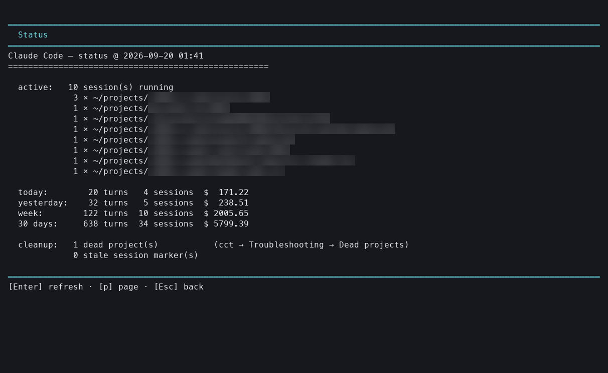

# cct — Claude Code session browser

See what Claude Code has been doing on your machine: which sessions ran, what
they cost, which tools and files they touched, and what you actually typed.

Claude Code stores every session as a transcript under `~/.claude/projects/`,
but gives you no way to list or inspect them outside its own resume picker.
`cct` is an arrow-key terminal UI over those transcripts — no UUIDs, no paths to
type. It reads only; it never modifies or deletes your Claude Code state.


*(Project names, paths and session titles are blurred in all screenshots.)*

## Requirements

- macOS or Linux, `bash`
- [`jq`](https://jqlang.github.io/jq/) — `brew install jq` / `apt install jq`
- `python3` (3.8+) — stdlib only, nothing to `pip install`

## Install

```bash
git clone <this-repo> claude-code-cct
cd claude-code-cct
./install.sh          # symlinks cct into ~/.local/bin
```

Make sure `~/.local/bin` is on your `PATH` (the installer tells you if it isn't).
Because it's a symlink, `git pull` updates the installed command too.

```bash
./install.sh --force     # replace an unrelated cct already in ~/.local/bin
./uninstall.sh           # remove the symlink
./uninstall.sh --purge   # …and delete cached state in ~/.cache/cct
```

## Use it

```bash
cct       # from any directory
```

You get a menu:

| Entry | What you see |
| --- | --- |
| **Status** | At-a-glance dashboard: live sessions, today/week/30-day cost, cleanup hints |
| **Sessions in current project** | Sessions for the directory you're standing in |
| **Sessions in all projects** | Every session Claude Code knows about |
| **Active sessions** | Claude Code processes running right now, system-wide |
| **Cost report** | Estimated token spend: today / yesterday / week / 30 days |
| **Usage & cost by month** | Per-month totals, ←/→ to step between months |
| **Cost by project** | Spend ranked by project, with a daily trend per project |
| **Stack / tech used** | Languages and ecosystems you worked on, by time window |
| **Troubleshooting / cleanup** | Dead project folders, stale session markers |

**Status** answers "what's going on right now?" — what's running, what today
and this month cost, what needs cleaning up:



The session picker lists every session with its date, message count, title and
project:


Pick a session and you can see its **stats + cost**, its **tool usage** (files
read/written/edited, bash commands), or **your prompts** — just what you typed,
without tool noise.


### Where the money goes

**Cost report** sums recent spend; press `v` for the extended view, which splits
every window by model (Fable magenta, Opus blue, Sonnet green, Haiku yellow):


**Cost by project** ranks your projects by total spend:


Pick the most expensive one and you get its day-by-day trend — `v` again breaks
each day down by model, which is usually where an expensive week explains
itself:


Keys: ↑/↓ or `j`/`k`, PgUp/PgDn, Home/End, Enter selects, Esc or `q` goes back,
`v` toggles the extended view where offered, Ctrl-C quits.

Costs are **estimates** computed from token counts at public list prices; actual
billing may differ.

## Scripts on their own

The TUI just drives a set of standalone bash scripts — `status.sh`,
`list-sessions.sh`, `session-stats.sh`, `session-tools.sh`,
`session-questions.sh`, `cost-report.sh`, `project-costs.sh`, `stack-report.sh`,
`active-sessions.sh`, `dead-sessions.sh`. Run any of them directly if you'd
rather script or pipe the output.

Full options, example output, the pricing table and notes on the transcript
format are in [docs/reference.md](docs/reference.md).
